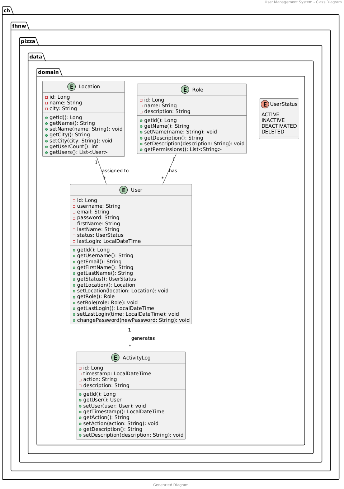

# User Management for Business Users
  
This is a User Management Tool for Business Users which manages User based in a Web-Application.

[](http://www.apache.org/licenses/LICENSE-2.0.html)

> 🚧: **This is a template project**: Make sure you adapt this documentation and the source code in this project according to your needs and use case. Comments are provided with "🚧:". Do not leave these comments in your final submission!

#### Contents:
- [Analysis](#analysis)
  - [Scenario](#scenario)
  - [User Stories](#user-stories)
  - [Use Case](#use-case)
- [Design](#design)
  - [Prototype Design](#prototype-design)
  - [Domain Design](#domain-design)
  - [Business Logic](#business-logic)
- [Implementation](#implementation)
  - [Backend Technology](#backend-technology)
  - [Frontend Technology](#frontend-technology)
- [Project Management](#project-management)
  - [Roles](#roles)
  - [Milestones](#milestones)

## Analysis
> 🚧: You can reuse the analysis (you made) from other projects (e.g., requirement engineering), but it must be submitted according to the following template. 

### Scenario
The system enables business administrators to efficiently manage user accounts, permissions, and roles across the organization. It provides a centralized platform for user provisioning, authentication, and access control with role-based authorization.

### User Stories
1. As an Admin, I want to create new user accounts so that I can add employees to the system.
2. As an Admin, I want to list all user accounts so that I can see all users in the system.
3. As an Admin, I want to list all locations along with the number of users assigned to each so that I can understand user distribution by location.
4. As an Admin, I want to update user information so that I can keep employee data up to date.
5. As an Admin, I want to deactivate or delete user accounts so that I can manage inactive employees.
6. As an Admin, I want to reset user passwords so that I can help users regain access to their accounts.
7. As an Admin, I want to map a user account to a working location so that I can track where employees are based.
8. As an Admin, I want to view user activity logs so that I can audit and monitor system usage.
9. As a User, I want to change my password so that I can maintain account security.

### Use Case


- UC-1 [List All Users]: Admin can retrieve and view all user accounts in the system.
- UC-2 [View Location Distribution]: Admin can view all locations with the count of users assigned to each.
- UC-3 [Update User Information]: Admin can modify and update employee data.
- UC-4 [Manage User Accounts]: Admin can deactivate or delete user accounts.
- UC-5 [Reset Password]: Admin can reset user passwords to help users regain access.
- UC-6 [Assign Working Location]: Admin can map users to working locations for geographical tracking.
- UC-7 [View Activity Logs]: Admin can audit and monitor user activity and system usage.
- UC-8 [Change Password]: User can change their own password for account security.

## Design
> 🚧: Keep in mind the Corporate Identity (CI); you shall decide appropriately the color schema, graphics, typography, layout, User Experience (UX), and so on.

### Wireframe
> 🚧: It is suggested to start with a wireframe. The wireframe focuses on the website structure (Sitemap planning), sketching the pages using Wireframe components (e.g., header, menu, footer) and UX. You can create a wireframe already with draw.io or similar tools. 

Starting from the home page, we can visit different pages. Available public pages are visible in the menu...

### Prototype
> 🚧: A prototype can be designed using placeholder text/figures in Budibase. You don't need to connect the front-end to back-end in the early stages of the project development.

### Domain Design
> 🚧: Provide a picture and describe your domain model; you may use Entity-Relationship Model or UML class diagram. Both can be created in Visual Paradigm - we have an academic license for it.

The `ch.fhnw.dream.data.domain` package contains the following domain objects / entities including getters and setters:



### Business Logic 
> 🚧: Describe the business logic for **at least one business service** in detail. If available, show the expected path and HTPP method. The remaining documentation of APIs shall be made available in the swagger endpoint. The default Swagger UI page is available at /swagger-ui.html.

Based on the UC-4, there will be two offers and a standard offer. Given a location, a message is shown accordingly:

- If the location is "Basel", the message is "10% off on all large pizzas!!!"
- If the location is "Brugg", the message is "two for the price of One on all small pizzas!!!"
- Otherwise, the message is "No special offer".

**Path**: [`/api/menu/?location="Basel"`] 

**Param**: `value="location"` Admitted value: "Basel","Brugg".

**Method:** `GET`

## Implementation
> 🚧: Briefly describe your technology stack, which apps were used and for what.

### Backend Technology
> 🚧: It is suggested to clone this repository, but you are free to start from fresh with a Spring Initializr. If so, describe if there are any changes to the PizzaRP e.g., different dependencies, versions & etc... Please, also describe how your database is set up. If you want a persistent or in-memory H2 database check [link](https://github.com/FHNW-INT/Pizzeria_Reference_Project/blob/main/pizza/src/main/resources/application.properties). If you have placeholder data to initialize at the app, you may use a variation of the method **initPlaceholderData()** available at [link](https://github.com/FHNW-INT/Pizzeria_Reference_Project/blob/main/pizza/src/main/java/ch/fhnw/pizza/PizzaApplication.java).

This Web application is relying on [Spring Boot](https://projects.spring.io/spring-boot) and the following dependencies:

- [Spring Boot](https://projects.spring.io/spring-boot)
- [Spring Data](https://projects.spring.io/spring-data)
- [Java Persistence API (JPA)](http://www.oracle.com/technetwork/java/javaee/tech/persistence-jsp-140049.html)
- [H2 Database Engine](https://www.h2database.com)

To bootstrap the application, the [Spring Initializr](https://start.spring.io/) has been used.

Then, the following further dependencies have been added to the project `pom.xml`:

- DB:
```XML
<dependency>
			<groupId>com.h2database</groupId>
			<artifactId>h2</artifactId>
			<scope>runtime</scope>
</dependency>
```

- SWAGGER:
```XML
   <dependency>
      <groupId>org.springdoc</groupId>
      <artifactId>springdoc-openapi-starter-webmvc-ui</artifactId>
      <version>2.3.0</version>
   </dependency>
```

### Frontend Technology
> 🚧: Describe your views and what APIs is used on which view. If you don't have access to the Internet Technology class Budibase environment(https://inttech.budibase.app/), please write to Devid on MS teams.

This Web application was developed using Budibase and it is available for preview at https://inttech.budibase.app/app/pizzeria. 

## Execution
> 🚧: Please describe how to execute your app and what configurations must be changed to run it. 

**The codespace URL of this Repo is subject to change.** Therefore, the Budibase PizzaRP webapp is not going to show any data in the view, when the URL is not updated or the codespace is offline. Follow these steps to start the webservice and reconnect the webapp to the new webservice url. 

> 🚧: This is a shortened description for example purposes. A complete tutorial will be provided in a dedicated lecture.

1. Clone PizzaRP in a new repository.
2. Start your codespace (see video guide at: [link](https://www.youtube.com/watch?v=_W9B7qc9lVc&ab_channel=GitHub))
3. Run the PizzaRP main available at PizzaApplication.java on your own codespace.
4. Set your app with a public port, see the guide at [link](https://docs.github.com/en/codespaces/developing-in-a-codespace/forwarding-ports-in-your-codespace).
5. Create an own Budibase app, you can export/import the existing Pizzeria app. Guide available at [link](https://docs.budibase.com/docs/export-and-import-apps).
6. Update the pizzeria URL in the datasource and publish your app.

### Deployment to a PaaS
> 🚧: Deployment to PaaS is optional but recommended as it will make your application (backend) accessible without server restart and through a unique, constantly available link.  

Alternatively, you can deploy your application to a free PaaS like [Render](https://dashboard.render.com/register).
1. Refer to the Dockerfile inside the application root (FHNW-INT/Pizzeria_Reference_Project/pizza).
2. Adapt line 13 to the name of your jar file. The jar name should be derived from the details in the pom.xml as follows:<br>
`{artifactId}-{version}.jar` 
2. Login to Render using your GitHub credentials.
3. Create a new Web Service and choose Build and deploy from a Git repository.
4. Enter the link to your (public) GitHub repository and click Continue.
5. Enter the Root Directory (name of the folder where pom.xml resides).
6. Choose the Instance Type as Free/Hobby. All other details are default.
7. Click on Create Web Service. Your app will undergo automatic build and deployment. Monitor the logs to view the progress or error messages. The entire process of Build+Deploy might take several minutes.
8. After successful deployment, you can access your backend using the generated unique URL (visible on top left under the name of your web service).
9. This unique URL will remain unchanged as long as your web service is deployed on Render. You can now integrate it in Budibase to make API calls to your custom endpoints.

## Project Management
> 🚧: Include all the participants and briefly describe each of their **individual** contribution and/or roles. Screenshots/descriptions of your Kanban board or similar project management tools are welcome.

### Roles
- Back-end developer: Charuta Pande 
- Front-end developer: Devid Montecchiari

### Milestones
1. **Analysis**: Scenario ideation, use case analysis and user story writing.
2. **Prototype Design**: Creation of wireframe and prototype.
3. **Domain Design**: Definition of domain model.
4. **Business Logic and API Design**: Definition of business logic and API.
5. **Data and API Implementation**: Implementation of data access and business logic layers, and API.
6. **Security and Frontend Implementation**: Integration of security framework and frontend realisation.
7. (optional) **Deployment**: Deployment of Web application on cloud infrastructure.


#### Maintainer
- Charuta Pande
- Devid Montecchiari

#### License
- [Apache License, Version 2.0](blob/master/LICENSE)
=======
# Internet-Technology-GroupWork