# DayDream

DayDream is a web application to create, manage, and share daydreams.

Users can:
- sign up and log in
- create, update, and delete their own daydreams
- choose public or private visibility
- comment on daydreams
- access an admin page (admin role) for moderation tasks

## Contents

- [Requirements Analysis](#requirements-analysis)
- [Design Decisions](#design-decisions)
- [Implementation](#implementation)
- [Installation](#installation)
- [Links](#links)
- [Deliverables Status](#deliverables-status)
- [Project Management](#project-management)
- [License](#license)

## Requirements Analysis

### Project Context

This project was developed for the FHNW Internet Technology group work assessment.

### Scenario

The platform enables users to store personal ideas and optionally share them publicly.
A user can keep daydreams private, publish selected content, and interact with the community through comments.

### User Stories

### Core user stories
1. As a user, I want to register so that I can create my own account.
2. As a user, I want to log in so that I can access protected features.
3. As a user, I want to browse public daydreams so that I can discover content.
4. As a user, I want to create, edit, and delete my own daydreams.
5. As a user, I want to choose visibility (public/private) for each daydream.
6. As a user, I want to comment on daydreams.
7. As an admin, I want to manage users and daydreams.

### Domain Model

The domain model consists of **4 entities** and **1 enum**:

**Entities:**
- User
- Daydream
- Comment
- Tag

**Enum:**
- Visibility

Domain diagram:

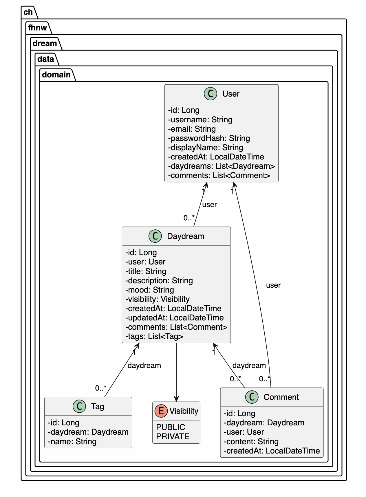

### Use Case Overview

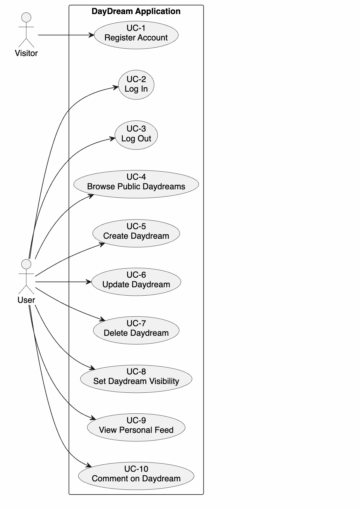

## Design Decisions

### Architecture

The application follows a **three-layer, two-tier architecture**:

### Frontend Tier
- **Frontend** (React + Vite discussed with Devid): Single-page application consuming REST APIs. Route-based views, protected routes, role-based navigation, and local JWT token handling.

### Backend Tier (Three Layers)
- **Controller layer** (Spring Boot): REST endpoints for auth, daydreams, comments, users, and admin operations. Input validation at the API boundary.
- **Service layer** (Spring Boot): Business rule enforcement, ownership checks, visibility filtering.
- **Repository layer** (Spring Data JPA): Database access via JPA repositories.
- **Database** (H2 in-memory): Seeded on startup with demo users and daydream content.

### Communication
The frontend communicates with the backend exclusively through REST API calls. Authentication uses JWT bearer tokens — the token is stored locally after login and attached to every subsequent API request.

### Design Principles

- **OOP and domain modeling:** The backend is structured around the domain entities `User`, `Daydream`, `Comment`, and `Tag`, with `Visibility` as an enum for controlled state handling.
- **Architectural patterns:** The application uses a controller-service-repository pattern to separate API handling, business logic, and data access responsibilities.
- **API design principles:** REST endpoints are grouped by responsibility (`/v1/auth`, `/v1/dreams`, `/v1/admin`) and documented through OpenAPI/Swagger.
- **DRY principle:** Reusable frontend components such as `Shell`, `ProtectedRoute`, `DaydreamCard`, and `DaydreamComposer` reduce duplication across views.
- **CRUD paradigm:** The application supports create, read, update, and delete operations for daydreams, plus administrative delete operations for moderation.
- **Routing and separation of concerns:** React Router manages frontend navigation, while Spring Boot handles backend processing and persistence separately.

### Constraints Reflected

- **At least three layers on two tiers:** The solution uses a frontend tier and a backend tier with controller, service, and repository layers.
- **At least four views:** The application provides more than four views, including landing, login, signup, feed, create, detail, profile, and admin pages.
- **At least four entities:** The domain model contains four entities (`User`, `Daydream`, `Comment`, `Tag`) and one enum (`Visibility`).
- **Business rule in the service layer:** Ownership checks, admin-only moderation, and visibility filtering are implemented in the service layer and security configuration.
- **Responsive web design:** The interface is responsive on desktop and mobile to improve user experience and usability across devices.
- **Technology constraints:** The backend is implemented with Spring Boot 3 and Java 17, the API is documented with OpenAPI 3.0, and the frontend choice was technically justified as a full-code solution.

### Project Structure

### Backend

```
_backend/
├── src/main/
│   ├── java/ch/fhnw/dream/
│   │   ├── DayDreamApplication.java (bootstrap, seed data)
│   │   ├── business/service/
│   │   │   ├── DaydreamService.java
│   │   │   └── UserService.java
│   │   ├── controller/
│   │   │   ├── AdminController.java
│   │   │   ├── AuthController.java
│   │   │   ├── DaydreamController.java
│   │   │   ├── SpaController.java
│   │   │   └── UserController.java
│   │   ├── data/domain/
│   │   │   ├── Comment.java
│   │   │   ├── Daydream.java
│   │   │   ├── Tag.java
│   │   │   ├── User.java
│   │   │   └── Visibility.java (enum)
│   │   ├── data/repository/
│   │   │   ├── CommentRepository.java
│   │   │   ├── DaydreamRepository.java
│   │   │   └── UserRepository.java
│   │   └── security/
│   │       └── SecurityConfig.java
│   └── resources/
│       └── application.properties
├── pom.xml
├── mvnw / mvnw.cmd
└── Dockerfile
```

### Frontend

```
_frontend/
├── src/
│   ├── components/
│   │   ├── DaydreamCard.jsx
│   │   ├── DaydreamComposer.jsx
│   │   ├── ProtectedRoute.jsx
│   │   └── Shell.jsx
│   ├── context/
│   │   └── AuthContext.jsx
│   ├── pages/
│   │   ├── AdminPage.jsx
│   │   ├── CreateDaydreamPage.jsx
│   │   ├── DaydreamDetailPage.jsx
│   │   ├── FeedPage.jsx
│   │   ├── LandingPage.jsx
│   │   ├── LoginPage.jsx
│   │   ├── ProfilePage.jsx
│   │   └── SignupPage.jsx
│   ├── services/
│   │   └── api.js
│   ├── App.jsx
│   ├── index.css
│   └── main.jsx
├── dist/ (compiled output)
├── index.html
├── package.json
└── vite.config.js
```

### Implemented Views

- Landing page
- Login page
- Signup page
- Feed page
- Create daydream page
- Daydream detail page
- Profile page
- Admin page

### Wireframes

### 01 Landing
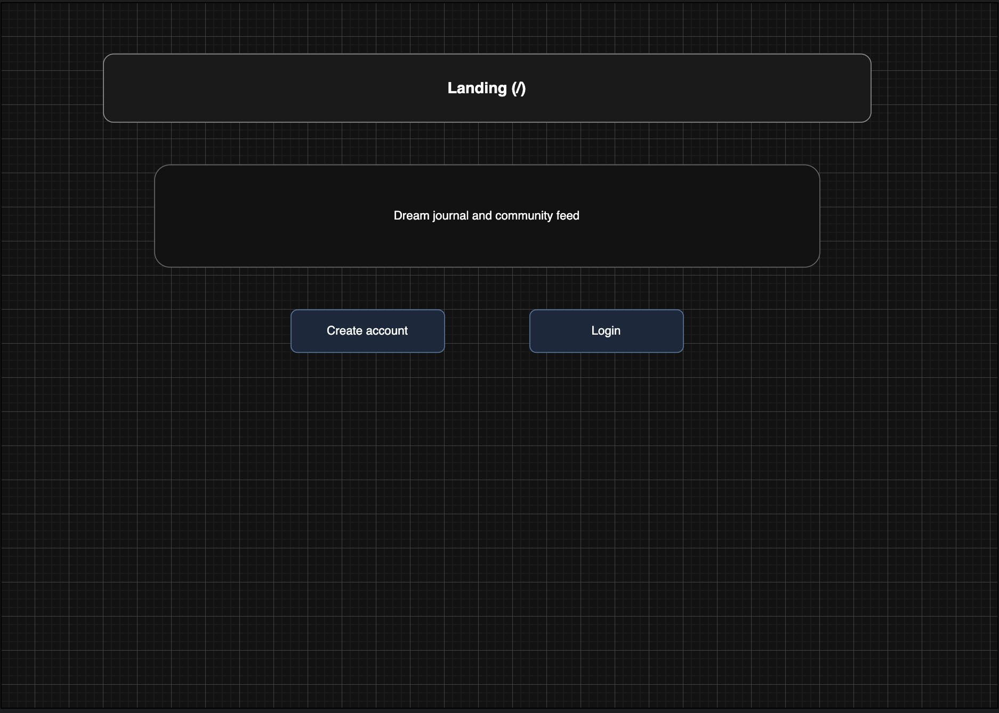

### 02 Login
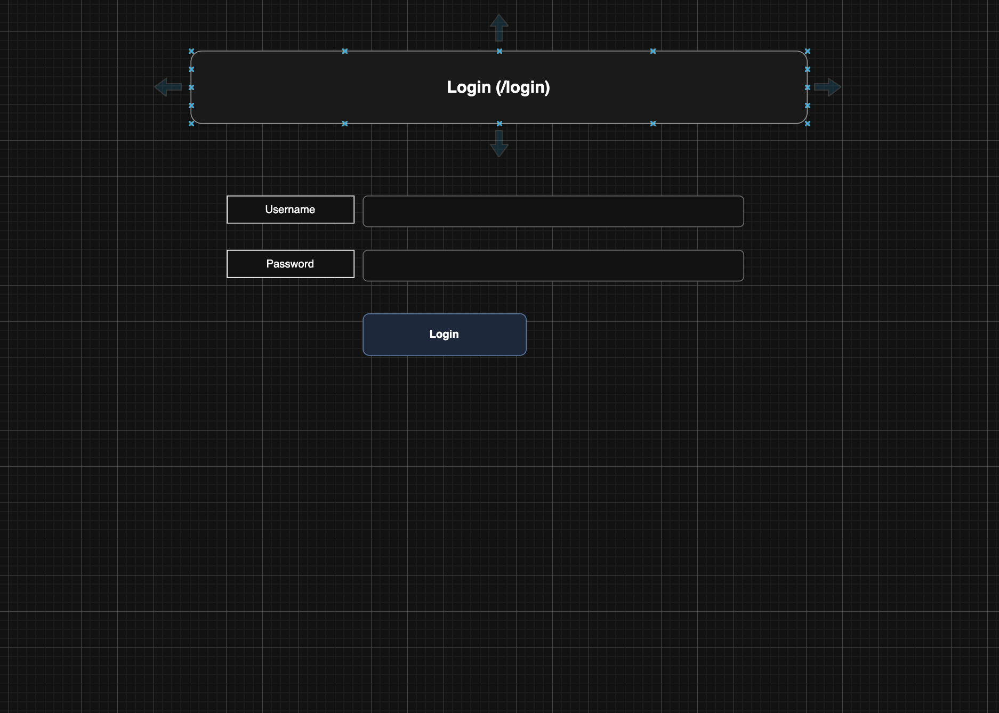

### 03 Signup
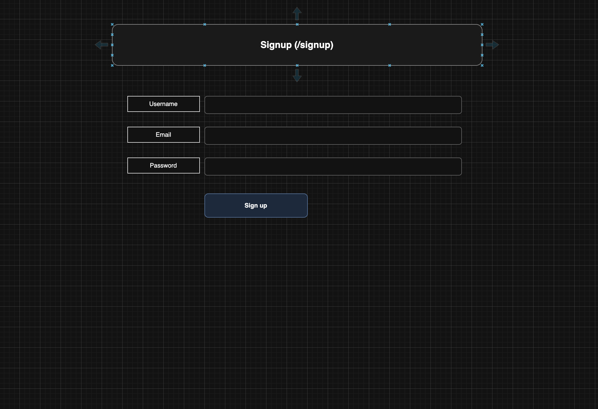

### 04 Protected Shell
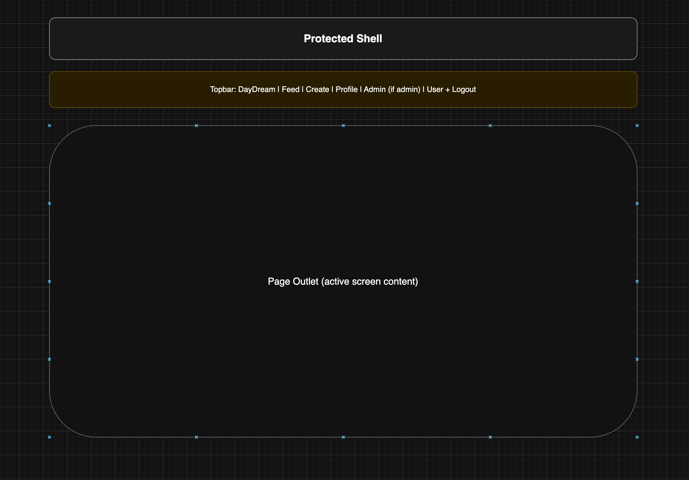

### 05 Feed
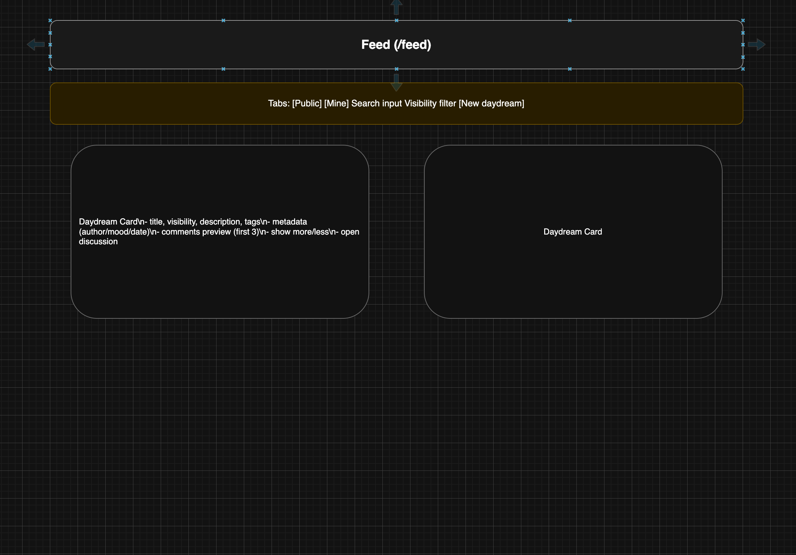

### 06 Create Daydream
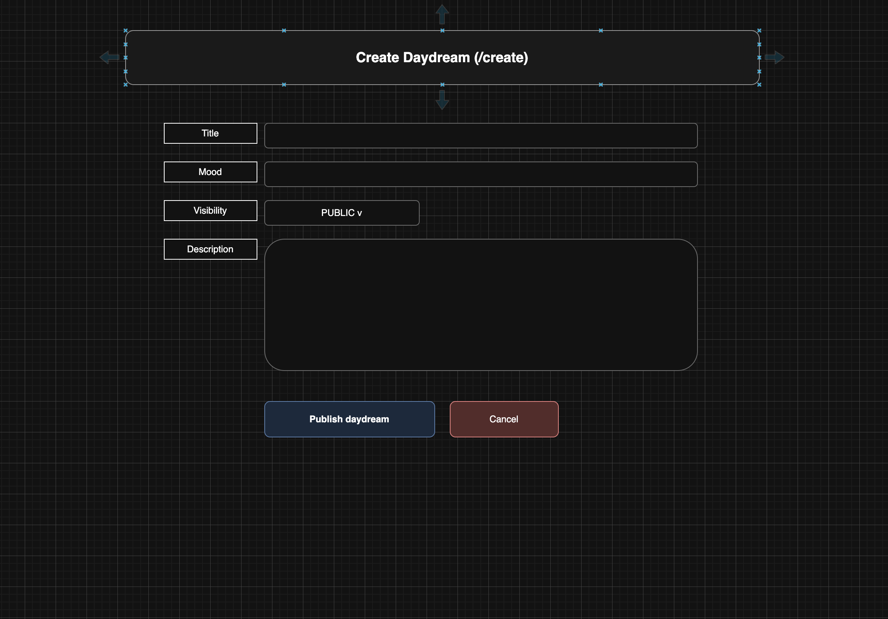

### 07 Daydream Detail
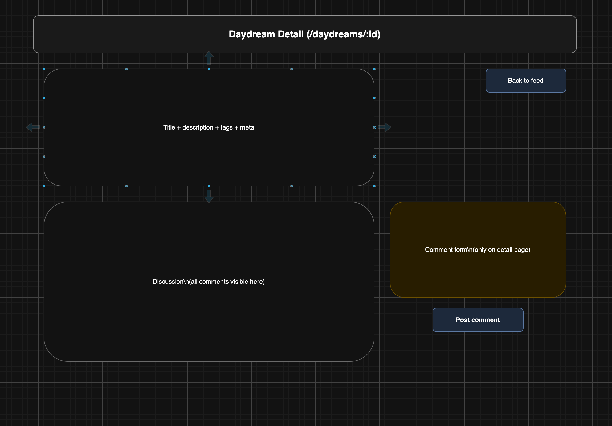

### 08 Profile
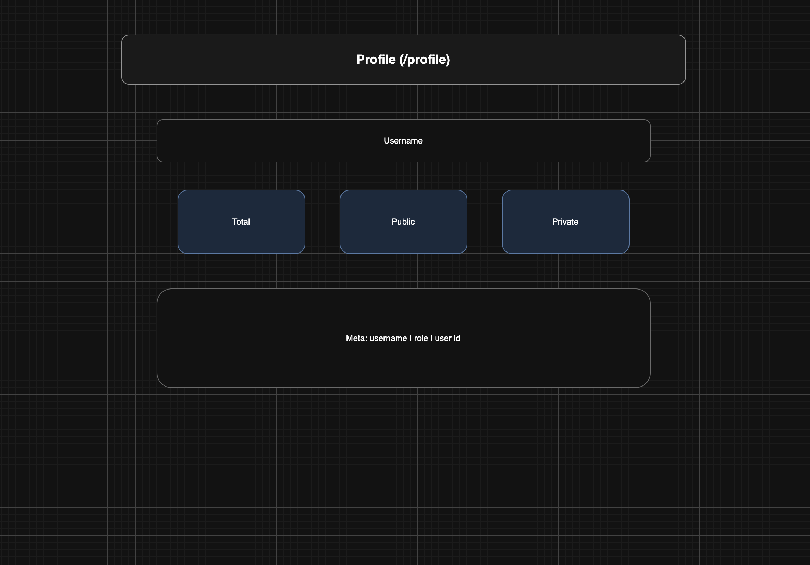

### 09 Admin
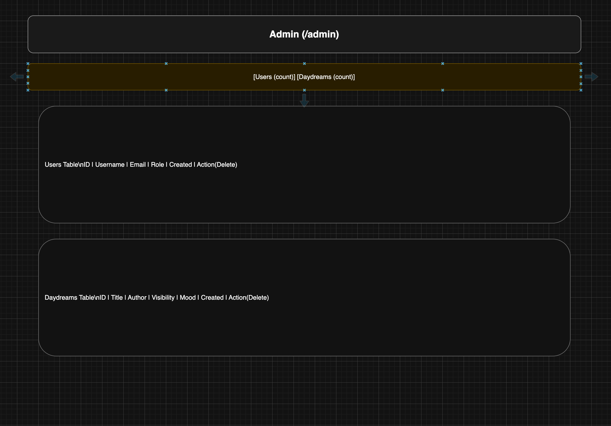

### 10 Navigation Map
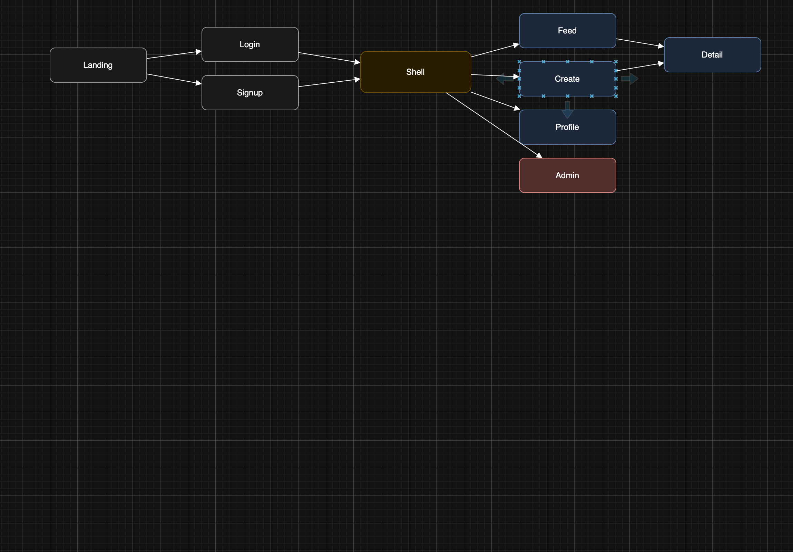

### Responsive Design

The application is designed to work on both desktop and mobile devices. We implemented the responsive layout to increase user experience by making the interface clearer and easier to use on smaller screens. The following mobile screenshot shows the create daydream view on a narrow screen, including responsive spacing, stacked form fields, and the compact mobile navigation.

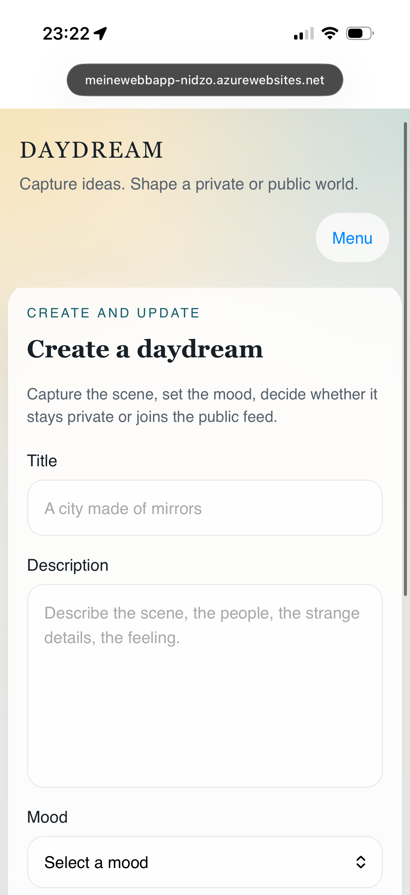

## Implementation

### Frontend Approach

The full-code frontend approach (React instead of a low-code tool) was chosen because the required functionality — protected routes, role-based rendering, and inline edit composer — could not be achieved with a low-code tool without significant limitations.

### Business Logic

The service layer enforces the following business rules that reflect real application constraints:

### Rule 1: Ownership enforcement on update and delete

A user can only update or delete a daydream they own. The `DaydreamService` checks the authenticated username against `daydream.getUser().getUsername()` before any mutating operation. Unauthorized access throws a `SecurityException`, resulting in HTTP 403.

**Endpoint:** `PUT /v1/dreams/{id}` and `DELETE /v1/dreams/{id}`  
**Method:** `PUT` / `DELETE`  
**Constraint:** Caller username must match the daydream owner.

### Rule 2: Admin-only moderation

Only users with role `ADMIN` may delete any daydream (including private ones) or delete user accounts. Enforced via Spring Security `@PreAuthorize("hasRole('ADMIN')")` on the `AdminController`.

**Endpoint:** `DELETE /v1/admin/dreams/{id}` and `DELETE /v1/admin/users/{id}`  
**Method:** `DELETE`  
**Constraint:** Caller must carry role `ADMIN`.

### Rule 3: Visibility filtering

Public daydreams are accessible to any authenticated user. Private daydreams are only returned via the personal feed endpoint scoped to the authenticated user. `DaydreamService.getDaydreamsByVisibility(Visibility.PUBLIC)` ensures private content is never exposed through the public feed.

**Endpoint:** `GET /v1/dreams/public`  
**Method:** `GET`  
**Constraint:** Only `visibility=PUBLIC` daydreams are returned.

The full Swagger/OpenAPI documentation is available at:  
[https://meinewebbapp-nidzo.azurewebsites.net/swagger-ui.html](https://meinewebbapp-nidzo.azurewebsites.net/swagger-ui.html)

### API Summary

### Authentication
- POST /v1/auth/signup
- POST /v1/auth/login

### Daydreams
- GET /v1/dreams/public
- GET /v1/dreams/my
- GET /v1/dreams/all
- POST /v1/dreams
- PUT /v1/dreams/{id}
- DELETE /v1/dreams/{id}
- POST /v1/dreams/{daydreamId}/comments

### Admin
- GET /v1/admin/users
- DELETE /v1/admin/users/{id}
- GET /v1/admin/dreams
- DELETE /v1/admin/dreams/{id}

### Security

The backend includes role-based authorization with protected admin endpoints.
Current project version uses JWT-based bearer authentication for API access.

### Technology Stack

### Backend
- Java 17
- Spring Boot 3.2.2
- Spring Web
- Spring Data JPA
- Spring Security
- Spring OAuth2 Resource Server
- Springdoc OpenAPI
- H2 database

### Frontend
- React 18
- React Router
- Vite
- CSS

## Installation

### Running app (deployed)

- Web application: [https://meinewebbapp-nidzo.azurewebsites.net/](https://meinewebbapp-nidzo.azurewebsites.net/)
- Swagger UI: [https://meinewebbapp-nidzo.azurewebsites.net/swagger-ui.html](https://meinewebbapp-nidzo.azurewebsites.net/swagger-ui.html)

### Running locally

**Frontend**
```bash
cd _frontend
npm install
npm run dev
```
Dev server starts at `http://localhost:3000`.

**Backend**
```bash
cd _backend
docker build -t my-image .
docker run -p 8080:8080 my-image
```
Backend API runs at `http://localhost:8080`.  
Swagger UI available at `http://localhost:8080/swagger-ui.html`.

The H2 database is in-memory and automatically seeded with demo users and daydreams on startup.

### Demo Credentials (Seed Data)

- admin / admin1234
- additional demo users are seeded in backend startup initialization

## Links

- Running app on the Azure Cloud☁️: https://meinewebbapp-nidzo.azurewebsites.net/
- OpenAPI (Swagger UI): https://meinewebbapp-nidzo.azurewebsites.net/swagger-ui.html
- OpenAPI JSON: https://meinewebbapp-nidzo.azurewebsites.net/v3/api-docs
- Presentation video: https://meinewebbapp-nidzo.azurewebsites.net/

## Deliverables Status

- Source code: available in this repository
- Documentation: this README
- Running demonstrator: available via link above
- Video presentation: available via link above

## Project Management

### Roles

| Member | Primary Role |
|---|---|
| Nikola Matovic | Architect, cloud engineering, backend-frontend integration |
| Luca Masella | Design, business case framing, requirements |
| Jasin Jusufi | Backend implementation, API endpoints, service layer |
| Silvan Rebmann | Frontend implementation, domain model, UI/UX |

All members participated in planning, reviews, testing, and iterative improvements across both frontend and backend.

### Milestones

| # | Milestone | Status |
|---|---|---|
| 1 | Analysis: scenario ideation, use case analysis, user story writing | ✅ |
| 2 | Domain Design: definition of domain model | ✅ |
| 3 | Frontend implementation: design, prototyping and realization | ✅ |
| 4 | Business Logic and API Design: definition of business logic and API | ✅ |
| 5 | Data and API implementation: data access and business logic layers | ✅ |
| 6 | Security: API-level security with role-based authorization | ✅ |
| 7 | Demonstrator: end-to-end application consuming REST APIs | ✅ |

### Collaboration and Communication

The team distributed responsibilities across architecture, design, backend, and frontend work while still collaborating on reviews and integration tasks. Progress and source code were managed through GitHub to keep version history and shared project information transparent. The README served as the central documentation artifact for requirements, design decisions, implementation details, and installation instructions.


## License

Apache License 2.0. See LICENSE.
